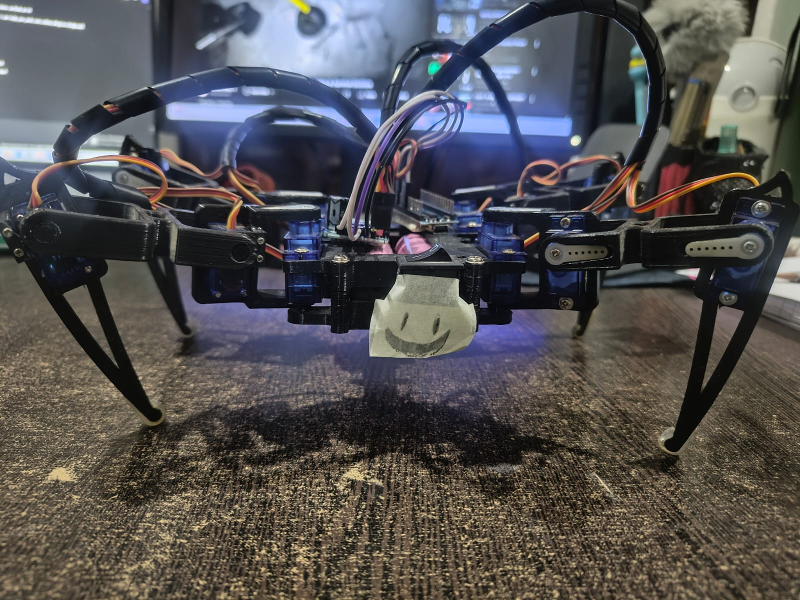
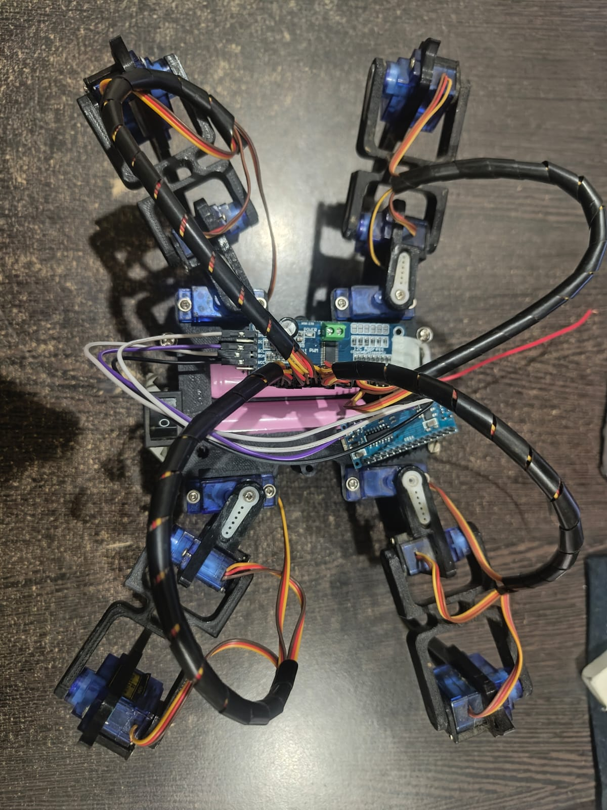

# Quadruped Spider Robot

A 12-DOF quadruped spider robot built using an Arduino Uno, PCA9685 servo driver, and 12 servo motors. The robot demonstrates coordinated gait control and four-legged locomotion using embedded systems and robotics principles.

## Project Overview

This project focuses on the design and development of a low-cost quadruped robot capable of performing walking and turning movements. Each leg has three degrees of freedom, allowing the robot to mimic animal-like locomotion.

## Features

- 12-DOF quadruped robot
- Four-legged walking and turning
- Arduino Uno based control system
- PCA9685 servo driver for multi-servo control
- Gait-based locomotion
- Modular and expandable design

## Hardware Components

| Component              | Quantity   |
|------------------------|------------|
| Arduino Uno            |        1   |
| PCA9685 Servo Driver   |        1   |
| SG90 Servo Motors      |        12  |
| 18650 Li-ion Batteries |        2   |
| LM2596 Buck Converter  |        1   |
| Jumper Wires           |        20+ |
| Custom Chassis         |        1   |

## Working Principle

Each leg consists of three servo motors providing three degrees of freedom:

- Hip Joint
- Knee Joint
- Ankle Joint

The Arduino Uno communicates with the PCA9685 servo driver through I2C. The PCA9685 generates PWM signals to control all twelve servo motors and execute coordinated gait patterns for stable locomotion.

## Screenshots

### Front View

### Top View

## Applications

- Robotics education
- Search and rescue robotics
- Surveillance systems
- Research and experimentation
- Autonomous robotic platforms

## Future Improvements

- Obstacle avoidance
- Bluetooth or Wi-Fi control
- IMU-based balancing
- Terrain-adaptive gait algorithms
- Computer vision integration

## Technologies Used

- Arduino IDE
- Embedded C/C++
- I2C Communication
- PWM Servo Control
- Robotics and Mechatronics

## License

MIT License
